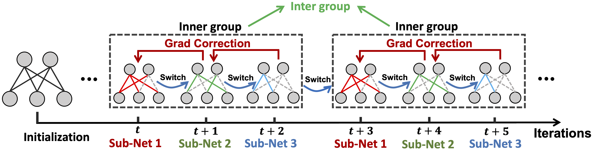

# AST: Alternating Sparse Training



**Get more at once: Alternating Sparse Training with Gradient Correction (NeurIPS 2022)**

Li Yang\*, Jian Meng\*, [Jae-sun Seo](https://faculty.engineering.asu.edu/jseo/), and [Deliang Fan](https://dfan.engineering.asu.edu/).

Arizona State University

**Abstract**

*Recently, a new trend of exploring training sparsity has emerged, which  remove parameters during training, leading to both training and inference efficiency improvement. This line of works primarily aims to obtain a single sparse model under a pre-defined large sparsity ratio. It leads to a static/fixed sparse inference model that is not capable of adjusting or re-configuring its computation complexity (i.e., inference structure, latency) after training for real-world varying and dynamic hardware resource availability. To enable such run-time or post-training network morphing, the concept of 'dynamic inference' or `training-once-for-all' has been proposed to train a single network consisting of multiple sub-nets once, but each sub-net could perform the same inference function with different computing complexity. However, the traditional dynamic inference training method requires a joint training scheme with multi-objective optimization, which suffers from very large training overhead. In this work, for the first time, we propose a novel alternating sparse training (AST) scheme to train multiple sparse sub-nets for dynamic inference without extra training cost compared to the case of training a single sparse model from scratch. Furthermore, to mitigate the interference of weight update among sub-nets without losing the generalization of optimization, we propose gradient correction within the inner-group iterations to reduce their weight update interference. We validate the proposed AST on multiple datasets against state-of-the-art sparse training method, which shows that AST achieves similar or better accuracy, but only needs to train once to get multiple sparse sub-nets with different sparsity ratios. More importantly, comparing with the traditional joint training based dynamic inference training methodology, the large training overhead is completely eliminated without affecting the accuracy of each sub-net.* 

## Major Requirements

```python
python = 3.7.4
pytorch = 1.9.1
CUDA = 11.4
```

## Usage

All the hyperparameters and experimental setup are embedded inside the bash script (`.sh`) files. Before running the experiments, please specify the path of the installed Python at the very first line of the bash script:

```bash
PYTHON="/home/YOURHOME/anaconda3/bin/python"
```

### CIFAR Experiments

**Unstructured AST training**

```bash
bash run_cifar.sh
```

**N:M Structured sparsity**

```bash
bash run_nm_cifar.sh
```

### ImageNet Experiments

**Unstructured AST training**

```bash
bash run_imagenet.sh
```

